# Project 3 data_ethics_and_visualization

### Data Visualization Track

### Project Overview : 

* Finance Domain : Stock Analysis 
The objective of the project is to analyze the Annual and Quaterly Earning Per Share (EPS) in the US stock market-traded stock and also the comparision between the quarterly estimated and reported earnings per share. 

# Instructions on how to use and interact with the project
User will select the ticker/symbol from the drop down list box. The process will get and extract data using API for relevant ticker. User are provided options to select the types of chart they want to visialize. Options are proivded to view any single chart or view multiple charts at the same time.
Additional functionalities provided for e.g. for menu 'Home' will bring the homepage, 'Offer' will bring the details what we offers in this webpage for e.g. Annual/quarterly Earning, Quarterly Surprise Earning for the traded stock etc. The 'About' option will give the details of the developer of this website. 'Contact' option will allow user to contact developer for any question that user may have.
'To the top' will bring the top of the page.
the slides are provided to give the look and feel of different types of charts.
'Powered by' will bring the Rutgers Data Science BootCamp page. 

### Project Deliverables

1. Your project must include visualizations. The visualizations can be created with:

    Python (e.g. Matplotlib, Pandas plotting, hvplot)
    JavaScript (e.g. Plotly or Leaflet)

* The options are provided to visulize the trend using differt types of charts such as Bar, Line, Positive Negative chart

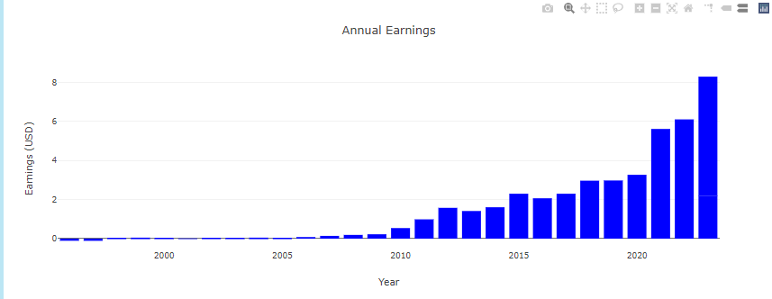
annual_earning

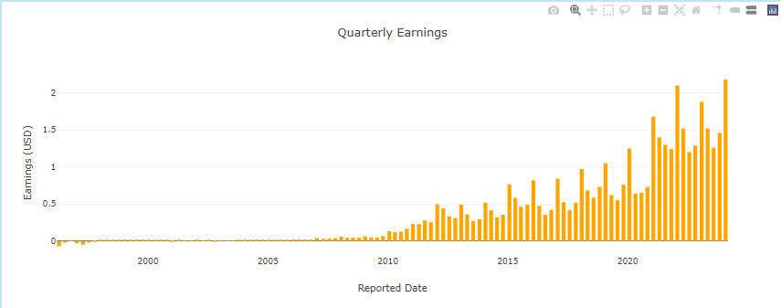
quarterly_earnings

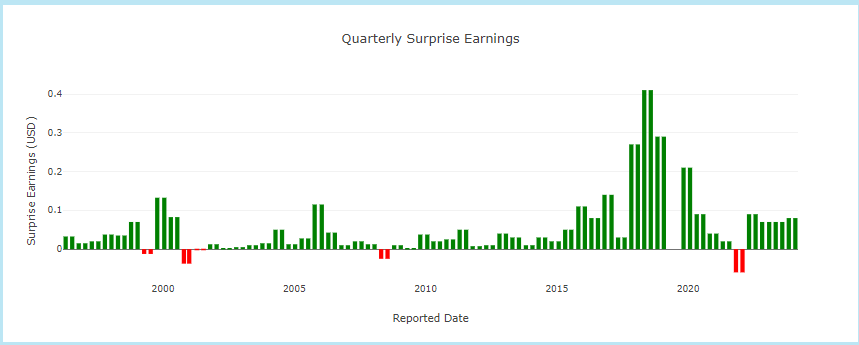
qtrly_surprise_earnings

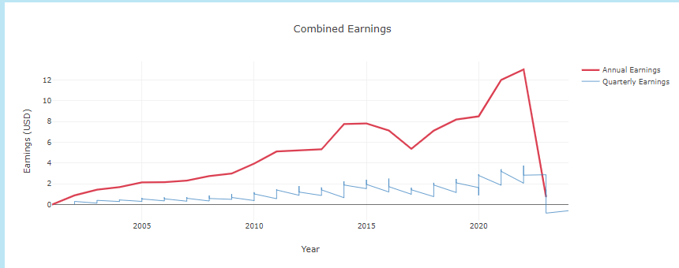
line_chart

2. Data must be stored in and extracted from at least one database (PostgreSQL, MongoDB, SQLite, etc).

* Data is stored in PostgreSQL

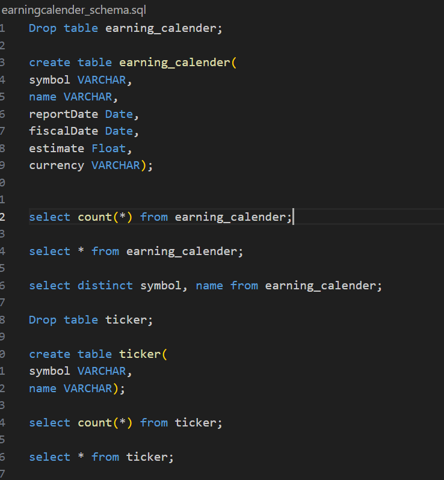

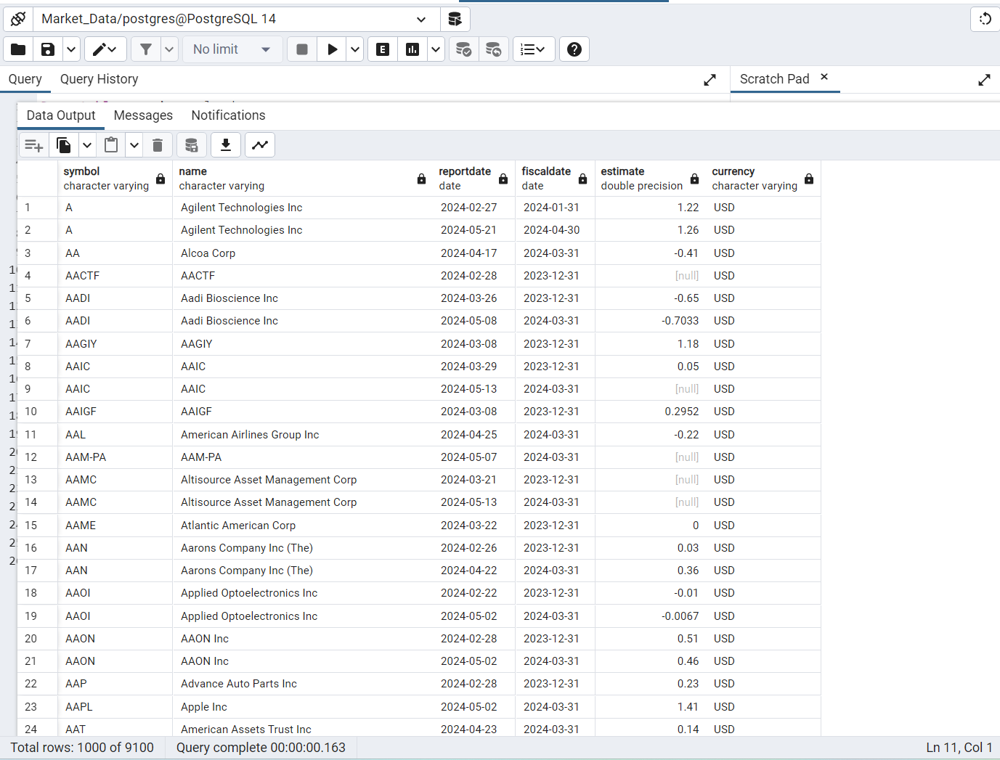

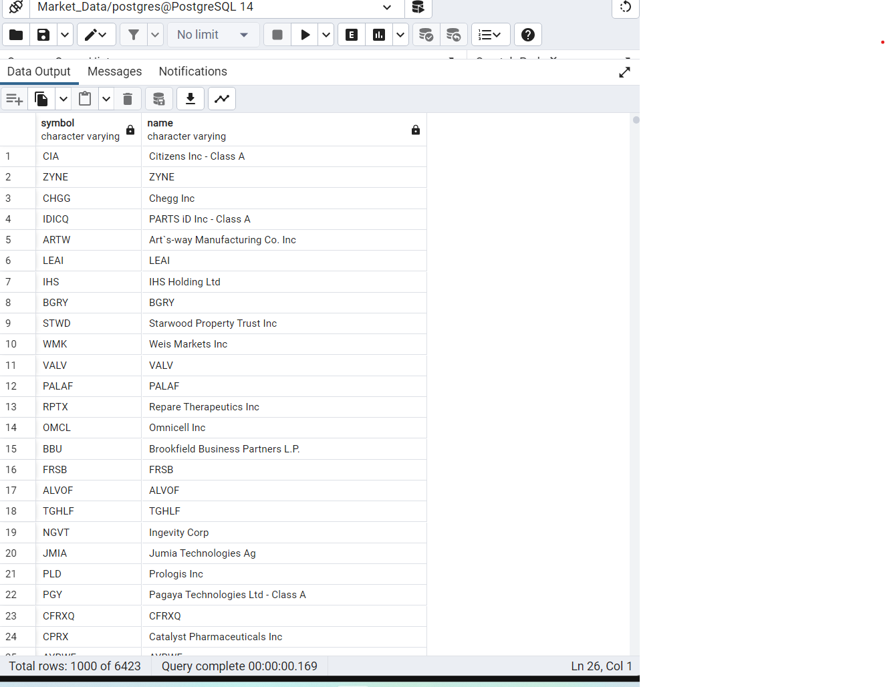

3. Your project must include at least one JavaScript OR Python library that we did not cover.

https://www.jsdelivr.com/package/npm/regression

4. Your project must be powered by a dataset with at least 100 records.

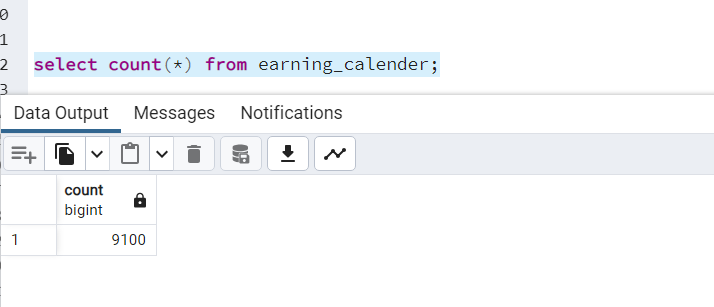
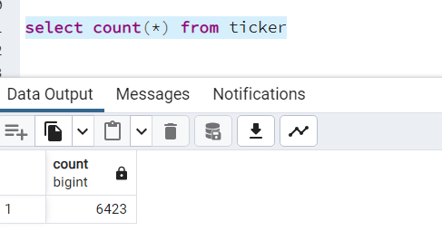

5. Pull down the dropdown menu to select stock ticker.

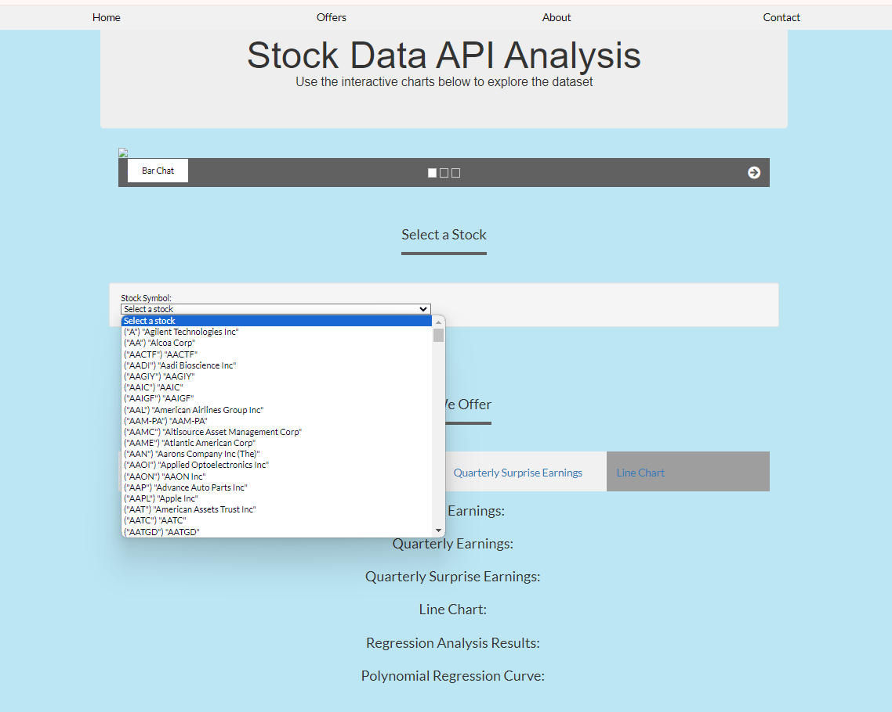

6. Your project must include some level of user-driven interaction, such as:

* Flask backend with interactive API routes that serve back Python or JavaScript created plots

* Visualizations created from user-selected filtered data, which could be powered by:

- JavaScript libraries

- Python in Jupyter Notebook

- Command-line Python scripts that save visualizations locally

7.  Ethical considerations
We are using public finance data and APIs

- References for the data source(s)
[API Documentation | Alpha Vantage](https://www.alphavantage.co/documentation/)

- the URL for datasource 
https://www.alphavantage.co/query?function=EARNINGS&symbol=${symbol}&apikey=${apiKey}

8. References for any code used that is not your own
https://www.w3schools.com/

https://stackoverflow.com/

9. The final website showing individual type of chart or all charts for the selected ticker (from the drop down list box)

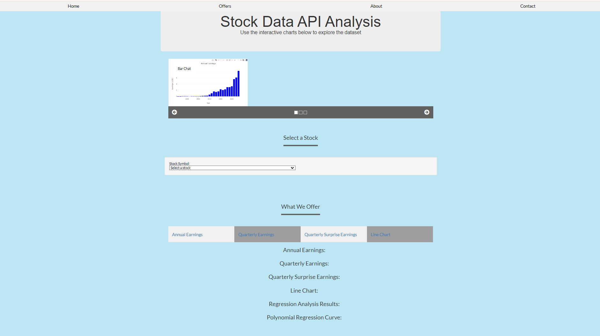

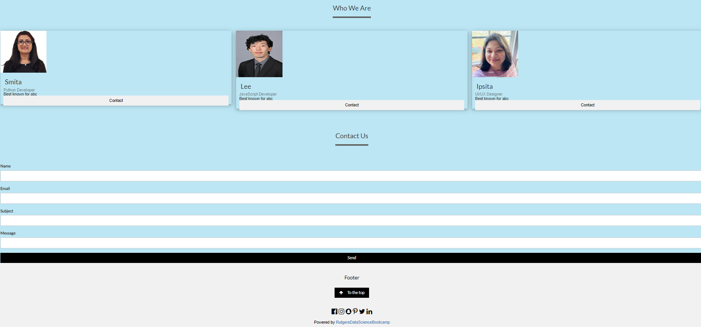

### Analysis/Conclusion : 
Earning Per Share (EPS)  serves as a fundamental tool for investors to assess a company's financial health, profitability, growth prospects, and valuation, helping them make informed investment decisions. However, our project is consider EPS as the main financial metrics  to gain a comprehensive understanding of a company's performance and prospects. 
There are further scope to expand this project to provide addition analysys to visulize the market data.
By incorporating additional analyses and visualizations, the project can provide investors with a more comprehensive and actionable view of market data, helping them make better-informed investment decisions.

